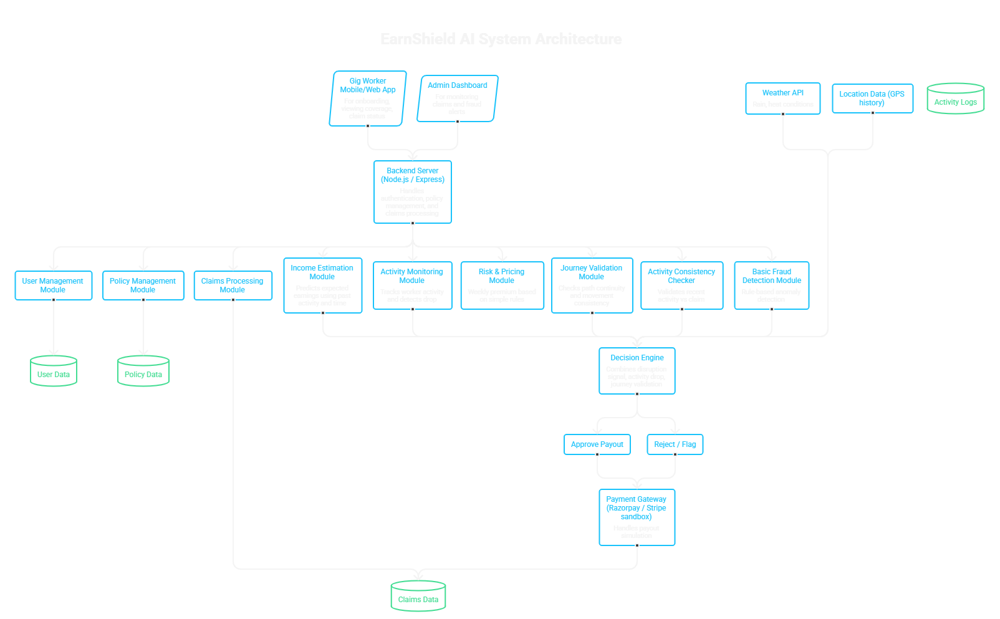
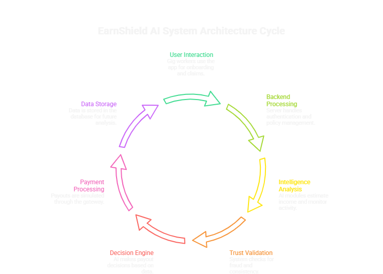
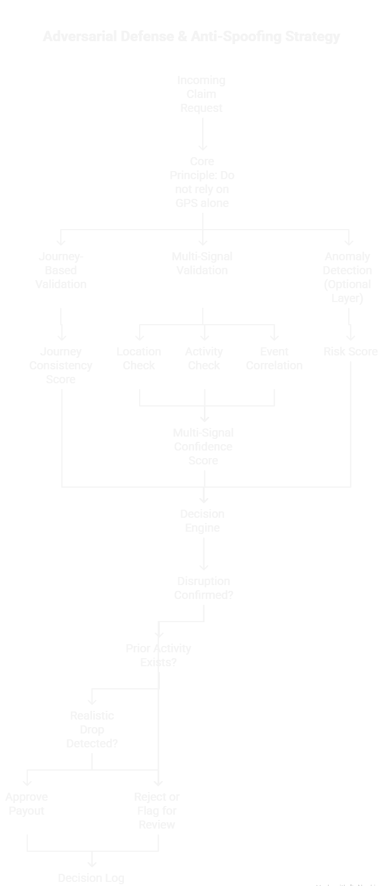

#  EarnShield AI: Context-Aware Income Protection for Gig Workers

---

## Problem Statement  

Gig workers (Swiggy, Zomato, Zepto, etc.) face unpredictable income loss due to external disruptions like extreme weather, pollution, and sudden local restrictions.  

Existing insurance systems:
- Rely on **static event-based triggers** (e.g., rain = payout)  
- Are vulnerable to **basic fraud (e.g., GPS spoofing)**  
- Do not reflect **actual income loss**  

 This leads to unfair payouts and lack of trust.

---

## 💡 Proposed Solution  

We propose **EarnShield AI**, an AI-powered parametric insurance platform that protects **actual income loss** using real-time activity and contextual signals.  
## Architecture

### 🔥 Core Idea  
> Instead of triggering payouts only based on events, we detect **real earning disruption** by comparing expected vs actual worker activity.

---

## 🧠 Key Features 

### 1. Income-Based Protection  
- Estimate expected earnings using:
  - Historical activity   
  - Time of day  
  - Location demand   
- Compare with actual activity  
- Trigger payout only if a **significant drop is observed during disruption**

---

### 2. Event + Activity Validation  
- Use simple external signals:
  - Weather API (rain, heat)  
  - Time-based disruption assumptions  
- Validate that:
  - Disruption exists  
  - Worker activity drops  

---

### 3. Automated Claim Trigger  
- No manual claim process  
- If conditions match → system triggers payout automatically  

---

### 4. Simple Risk & Pricing Model  
- Weekly premium based on:
  - Area risk (e.g., frequent rain zones)  
  - Basic worker activity level  
- Rule-based or simple ML model

---

### 5. Fair Payout System  
- Binary + simple logic:
  - Verified disruption + activity drop → payout  
  - Otherwise → no payout  

---

## 🛡️ Adversarial Defense & Anti-Spoofing Strategy 

###  1. Core Principle  
We avoid relying only on GPS, since it can be spoofed.  

Instead, we verify claims using **activity consistency + movement patterns**.

---

###  2. Journey-Based Validation 
- Check recent location history (not just one point)  
- Detect:
  - Sudden unrealistic jumps  
  - No prior movement before claim  

If no realistic journey → flag as suspicious  

---

###  3. Multi-Signal Validation  

We combine:

#### 📍 Location Check  
- GPS consistency over time  
- Basic distance/time validation  

#### 🚴 Activity Check  
- Recent activity logs (orders/deliveries simulated)  
- Active before disruption → stopped after  

#### 🌧️ Event Correlation  
- Weather API confirms disruption  
- Only affected zones considered  

---

### 4. Simple Anomaly Detection (Optional)  
- Identify unusual patterns like:
  - Repeated claims without activity  
  - Same pattern across multiple users  
 

---

### 5. Claim Decision Logic  

- If:
  - Disruption confirmed  
  - Worker was active before  
  - Activity dropped realistically  

→ Approve payout  

Else → reject or flag  

---

### 6. UX Balance  
- No manual claim filing  
- No penalties for minor inconsistencies  
- Only clearly invalid cases are rejected  

---

## System Workflow  

1. Worker registers  
2. System assigns weekly policy  
3. System monitors:
   - Weather conditions  
   - Worker activity  
4. If disruption occurs:
   - Check activity drop  
   - Validate movement pattern  
5. If valid → payout triggered  

---

## Tech Stack  

**Frontend:** React.js  
**Backend:** Node.js, Express.js  
**Database:** MongoDB  

**AI/Logic:** Python (optional), basic rule-based logic  

**APIs:** OpenWeather API  

**Payments:** Razorpay (Sandbox)  

**Tools:** GitHub, Postman  

---

## Dashboard  

### Worker View  
- Coverage status  
- Claim status  

### Admin View  
- Claims overview  
- Flagged cases  

---

## 🎯 Why Our Solution Works  

- Focuses on **real income loss**  
- Uses **simple, implementable logic**  
- Prevents basic fraud (GPS spoofing)  
- Fully feasible within hackathon timeline  
- Scalable with future improvements  

---

## Future Scope  

- Advanced ML-based prediction  
- Integration with gig platforms  
- Improved fraud detection models  

---
